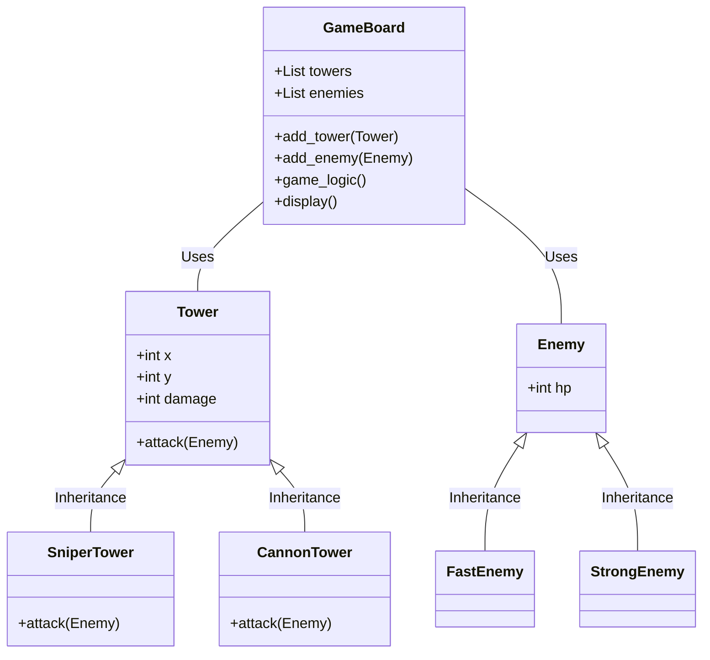

# Object-oriented Programming (OOP) in Python - Tower Defense Game

| Contents             |
| -------------------- |
| Introduction         |
| Encapsulation        |
| Abstraction          |
| Inheritance          |
| Polymorphism         |
| Tower Defense Game   |
| Assignment           |

---

# Introduction

We'll explore OOP through a Tower Defense game. This game will help you understand the four pillars of OOP:
  - Encapsulation
  - Abstraction
  - Inheritance
  - Polymorphism

---

# Encapsulation

Encapsulation in the game: Towers and Enemies as objects. Each object has properties and methods.

```python
class Tower:
    def __init__(self, x, y):
        self.x = x
        self.y = y
        self.damage = 10

    def attack(self, enemy):
        enemy.hp -= self.damage
```

---

# Abstraction

Abstraction in the game: GameBoard class. Manages the game logic, hiding complexity.

```python
class GameBoard:
    def __init__(self):
        self.towers = []
        self.enemies = []

    def add_tower(self, tower):
        self.towers.append(tower)
```

---

# Inheritance

Inheritance in the game: Different types of towers and enemies. Base classes for common properties and methods.

```python
class Enemy:
    def __init__(self, hp):
        self.hp = hp

class FastEnemy(Enemy):
    def __init__(self):
        super().__init__(hp=50)

class StrongEnemy(Enemy):
    def __init__(self):
        super().__init__(hp=100)
```

---

# Polymorphism

Polymorphism in the game: Different attack methods for towers. Child classes override the base class method.

```python
class SniperTower(Tower):
    def attack(self, enemy):
        enemy.hp -= self.damage * 2

class CannonTower(Tower):
    def attack(self, enemy):
        enemy.hp -= self.damage // 2
        # AoE damage logic here
```

---

# Tower Defense Game

Main game loop to manage towers and enemies. Uses encapsulation, abstraction, inheritance, and polymorphism.

```python
board = GameBoard()
while True:
    # Game logic here
    for tower in board.towers:
        for enemy in board.enemies:
            tower.attack(enemy)
```

---

# Assignment

## Objective

Create a Tower Defense game in Python without using any external libraries. Use classes for Towers, Enemies, and the GameBoard. Implement polymorphism by creating different types of towers and enemies.

## Requirements

1. Create a `Tower` class with methods for attacking.
2. Create an `Enemy` class with different types (Fast, Strong).
3. Create a `GameBoard` class to manage the game state.
4. Use a `while True` loop for the main game logic.
5. Implement polymorphism for different attack methods.

## Submission

Submit a Python script with your game implementation. Ensure your code is well-commented to explain your logic.

---

# Conclusion

OOP provides a structured way to manage game components. Encapsulation, abstraction, inheritance, and polymorphism are effectively used in game development. Your assignment will give you hands-on experience with these concepts.

Good luck with your Tower Defense game!

---

# Graph of the game

